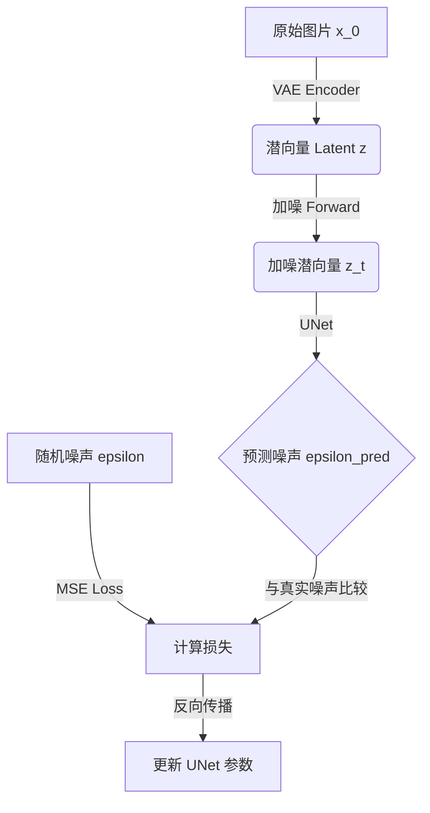

# Stable Diffusion 训练演示详解 (Training Demo Explained)

本文档详细解释了 `examples/train_demo.py` 的工作原理。这个脚本是一个最小化的 Latent Diffusion Model (LDM) 实现，旨在展示扩散模型是如何“学会画画”的。

## 1. 核心概念

### 1.1 为什么要“过拟合” (Overfitting)?
在深度学习中，过拟合通常是坏事。但在学习阶段，它是最好的调试工具。
如果我们让模型只学习**一张图片**（比如一个红圈），它应该能完美地记住这张图。如果连一张图都学不会，说明代码逻辑有根本性错误。

### 1.2 潜空间扩散 (Latent Diffusion)
我们不是直接在像素空间（256x256x3）上加噪，而是先用 VAE 将图片压缩到潜空间（32x32x4）。
*   **优点**: 计算量减少 64 倍 (8x8)。
*   **MockVAE**: 为了演示方便，我们实现了一个 `MockVAE`，它不含神经网络参数，仅仅通过下采样（Downsample）和上采样（Upsample）来模拟压缩过程。这保证了 Latent 具有明确的语义信息。

## 2. 训练流程图解

## 3. 代码步骤详解

### 第一步：数据准备
我们动态生成了一张 256x256 的白底红圈图片。数据范围归一化到 `[-1, 1]`。

### 第二步：VAE 压缩
使用 `MockVAE` 将图片从 `(3, 256, 256)` 压缩为 `(4, 32, 32)`。
*   **注意**: 这里的通道数从 3 扩展到 4，是为了模拟 Stable Diffusion 的标准输入格式。

### 第三步：训练循环 (Training Loop)
这是最核心的部分。在 `pipeline.diffusion.get_loss` 内部发生了以下魔法：
1.  **采样时间步 $t$**: 随机选择一个时刻（0 到 1000）。
2.  **生成噪声 $\epsilon$**: 从正态分布 $\mathcal{N}(0, I)$ 中采样。
3.  **加噪**: $x_t = \sqrt{\bar{\alpha}_t} x_0 + \sqrt{1 - \bar{\alpha}_t} \epsilon$
4.  **模型预测**: $\epsilon_{pred} = \text{UNet}(x_t, t, \text{text\_emb})$
5.  **计算 Loss**: $L = ||\epsilon - \epsilon_{pred}||^2$ (MSE Loss)

### 第四步：生成验证
训练过程中，我们会定期暂停训练，尝试用当前的 UNet 生成图片。
生成的原理是**反向扩散**：从纯噪声开始，UNet 一步步去除噪声，最终还原出红圈。

---

## 4. 关键技术细节与调试经验 (Critical Technical Details)

在实现这个 Demo 的过程中，我们解决了几个决定生成质量的核心问题。这些经验对于理解 Diffusion Model 至关重要。

### 4.1 信噪比与 Latent 缩放 (Signal-to-Noise Ratio)
*   **问题现象**: 训练收敛极慢，生成的图片背景有顽固的噪声。
*   **原理**: Stable Diffusion 官方使用 `0.18215` 的缩放因子来调整 VAE 输出的方差。但在我们的简化版 `MockVAE` 中，Latent 的数值范围本身就在 `[-1, 1]`。如果再乘以 `0.18`，信号强度变得极弱 (`[-0.18, 0.18]`)，而叠加的噪声 $\epsilon$ 是标准正态分布（方差为 1）。这导致**信噪比过低**，模型难以从巨大的噪声中提取微弱的图像信号。
*   **解决方案**: 移除了缩放因子，保持 Latent 在 `[-1, 1]` 范围，显著提升了信噪比，加速了收敛。

### 4.2 推理与训练步数对齐 (Schedule Alignment)
*   **问题现象**: 生成的图片像蒙了一层“薄纱”，细节模糊，底噪明显。
*   **原理**: 这是一个经典的**训练-推理不匹配**问题。
    *   **训练时**: 我们使用了 1000 步的 Noise Schedule。模型学会了在第 $t=999$ 步处理微小噪声，在 $t=0$ 步处理巨大噪声。
    *   **推理时**: 如果只用 50 步（DDPM 采样），模型会将推理时的第 49 步误认为是训练时的第 49 步（接近无噪状态），从而只去除极少量的噪声。
*   **解决方案**: 将推理步数调整为 **1000 步**，与训练保持严格一致。虽然速度变慢，但保证了模型能正确理解每一个时间步的噪声强度。

### 4.3 数值范围与颜色空间 (Value Range & Color Space)
*   **问题现象**: 图片颜色怪异（如红圈变成黄圈），或者出现高对比度的色块。
*   **原理**: PyTorch Tensor 通常在 `[-1, 1]` 范围，而 PIL Image 需要 `[0, 255]`。
    *   **错误做法**: 直接截断负值 `tensor.clamp(0, 1)`。这会导致所有负数（如红色通道的 -1 分量）直接变成 0（黑色），造成严重的颜色失真。
    *   **正确做法**: 线性映射 `(tensor / 2 + 0.5) * 255`。将 `[-1, 1]` 平滑映射到 `[0, 1]`，保留所有颜色信息。

### 4.4 VAE 的棋盘伪影 (Checkerboard Artifacts)
*   **问题现象**: VAE 重建的图像有规律的网格状纹理。
*   **原理**: 使用 `ConvTranspose2d`（转置卷积）进行上采样时，如果 Kernel Size 和 Stride 不匹配，会导致输出特征图重叠不均匀。
*   **解决方案**: 改用 `Upsample (Nearest/Bilinear) + Conv2d` 的组合。这种方法能保证上采样均匀，彻底消除棋盘伪影。

### 4.5 黑图与数值爆炸 (Black Image & Static Thresholding)
*   **问题现象**: 生成的图片全黑，或者在训练初期出现极大的噪声值。
*   **原理**: 在反向采样过程中，如果预测的噪声稍微偏大，会导致推算出的 $x_0$ 超出 `[-1, 1]` 范围。随着迭代进行（尤其是 1000 步），这种误差会累积并放大，导致数值爆炸（例如达到 -900）。在转为图片时，这些负值被截断为 0，导致黑图。
*   **解决方案**: 引入 **Static Thresholding (Clipping)**。
    *   在每一步采样中，先根据当前噪声预测计算出 $x_0$ 的估计值。
    *   强制将 $x_0$ 截断到 `[-1, 1]` 范围。
### 4.6 模型容量与学习率调度 (Model Capacity & LR Scheduler)
*   **问题现象**: 即使解决了上述所有问题，生成的图片仍然只有模糊的红色色块，背景不够白，对比度低。Loss 停留在 0.02 左右不再下降。
*   **原理**: 
    1.  **欠拟合 (Underfitting)**: 初始的 UNet 通道数只有 [32, 64, 128, 256]，参数量太少，无法捕捉锐利的几何边缘。
    2.  **学习率过高**: 一直使用 `1e-3` 的大学习率，导致模型在最优解附近震荡，无法收敛到 loss < 0.001 的精度。
*   **解决方案**:
    1.  **增大模型**: 将 UNet 通道数翻倍至 [64, 128, 256, 512]，显著提升了模型的表达能力。
    2.  **Cosine Annealing**: 引入余弦退火学习率调度器，让学习率从 `1e-3` 平滑下降到 `1e-6`。这使得模型在后期能进行精细的微调。
    *   **结果**: Loss 从 0.02 骤降至 **0.001**，生成的图片完美还原了“白底红圈”。
